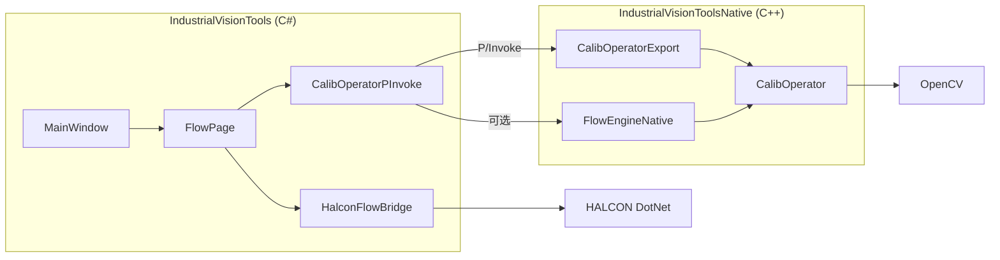

# XVCalibrate / IndustrialVisionTools — 代码框架说明（人工审查用）

> 本文档描述仓库**实际运行的工业视觉工具**分层与数据流，供 Code Review / 交接使用。  
> 旧版「九点标定 CLI 示例」说明见同目录 `Readme.md`（历史文档，目录结构已过时）。

---

## 1. 总览

本仓库主产品是 **WPF 桌面应用 `IndustrialVisionTools`**：流程编排 + 相机/PLC/光源 + 棋盘格/九点标定 + HALCON 形状匹配 + 分割训练等。

核心执行路径：

```
用户操作 (MainWindow 各 Page)
        │
        ▼
┌───────────────────────┐
│ IndustrialVisionTools │  C# / WPF（UI、流程图、算子调度、HALCON DotNet）
│  FlowPage / Halcon*   │
└───────────┬───────────┘
            │ P/Invoke (CalibOperatorPInvoke)
            ▼
┌───────────────────────┐
│ IndustrialVisionTools │  Native C++ DLL（OpenCV 算法 + 可选原生流程引擎）
│ Native.dll            │
│  CalibOperator.*      │
│  FlowEngineNative.*   │
└───────────────────────┘
            │
            ├─ OpenCV 4.x (opencv_world4130)
            ├─ 海康 MVS (MvCameraControl)
            ├─ HALCON (可选，HALCON_ENABLED)
            └─ 信捷 PLC / 光源 Controller SDK（可选）
```

**审查时优先看三层边界：**

| 层 | 职责 | 不应做的事 |
|----|------|------------|
| UI / FlowPage | 画布、参数、端口连线、弹窗确认、调用桥接 | 不写 OpenCV 像素级算法 |
| CalibOperatorPInvoke | 结构体布局、`DllImport`、托管类型封装 | 不写业务流程策略 |
| CalibOperator (C++) | 标定、去畸变、透视、轨迹等纯算法 | 不依赖 HWND/WPF |

---

## 2. 目录地图

```
calibrate-api/
├── XVCalibrate/                          ← VS 解决方案根
│   ├── XVCalibrate.sln
│   ├── ARCHITECTURE.md                   ← 本文档
│   ├── IndustrialVisionTools/            ← 主程序 (WinExe, net8.0-windows)
│   │   ├── App.xaml(.cs)                 ← 入口
│   │   ├── MainWindow.*                  ← 导航壳：流程/PLC/直方图/形状模板/分割…
│   │   ├── FlowPage*.cs                  ← 流程编辑器（拆分 partial）
│   │   ├── CalibOperatorPInvoke*.cs      ← Native DLL 封装
│   │   ├── HalconFlowBridge*.cs          ← HALCON 算子桥
│   │   ├── CameraService.cs              ← 海康取图
│   │   ├── NinePoint*.cs                 ← 九点配对/排序/质检弹窗
│   │   └── *Page.xaml(.cs)               ← 各功能页
│   ├── CalibOperator/                    ← Native 工程
│   │   ├── CalibOperator.h/.cpp          ← 算法实现
│   │   ├── CalibOperatorExport.h/.cpp    ← C ABI 导出 (CALIB_*)
│   │   ├── FlowEngineNative.cpp/.h       ← 可选原生 .flow 执行引擎
│   │   ├── IndustrialVisionToolsNative.vcxproj
│   │   └── STANDALONE_FRAMEWORK.md       ← 轨迹独立函数 API 说明（局部）
│   ├── FlowSmokeTests/                   ← 冒烟测试 Exe
│   └── CalibrationGUI/                   ← 遗留/辅助原生 GUI（非主路径）
├── flows/                                ← 产线 .flow.json 与帮助文档
│   ├── README.md / README_workflow_guide.md
│   ├── chessboard/                       ← 棋盘格标定示例
│   └── v1|v2|v3…/                        ← 配方版本目录（含 caliNinePoint 等）
├── opencv/ / Development/ / models/      ← 第三方与模型资产
└── bin/x64/Release/IndustrialVisionToolsNative.dll
```

---

## 3. 解决方案项目关系



编译顺序建议：

1. `CalibOperator` / `IndustrialVisionToolsNative` → `bin/x64/Release/IndustrialVisionToolsNative.dll`
2. `IndustrialVisionTools`（csproj 会 Copy 该 DLL 与 OpenCV DLL）
3. 可选：`FlowSmokeTests`

---

## 4. 流程引擎框架（最重要审查面）

### 4.1 概念

| 概念 | 说明 |
|------|------|
| `OperatorDef` | 算子类型定义：TypeId、参数、端口、分类（`FlowPage.OperatorCatalog.cs`） |
| `FlowNode` | 画布上的一个算子实例（参数字典 + 运行时 Outputs） |
| `Connection` | 端口连线：FromNode.Port → ToNode.Port |
| `.flow.json` | 序列化 Nodes + Connections + Meta |

### 4.2 执行路径

```
加载 .flow.json
    → 拓扑排序 / 按依赖执行节点
    → 对每个节点：收集输入端口 → switch(TypeId) 执行
    → 写入 node.Outputs → 供下游端口读取
```

**主调度实现：** `FlowPage.xaml.cs` 内大型 `ExecuteNode` / `RunFlow`（按 TypeId 分发）。  
**算子目录：** `FlowPage.OperatorCatalog.cs`（新增算子时先在此注册，再在执行 switch 中实现）。  
**可选原生引擎：** `FlowEngineNative.cpp`（部分算子的 C++ 侧复刻，供无 UI 跑图；与 C# 路径需保持语义一致）。

### 4.3 FlowPage 分文件（审查时按职责打开）

| 文件 | 职责 |
|------|------|
| `FlowPage.xaml(.cs)` | 画布交互、运行调度、大量算子 case |
| `FlowPage.OperatorCatalog.cs` | OperatorDef / PortDef / 参数 Options |
| `FlowPage.CanvasModels.cs` | 节点/连线视觉模型 |
| `FlowPage.FlowDocumentJson.cs` | 存盘/加载 DTO |
| `FlowPage.CalibrationGeometry.cs` | 标定相关几何辅助 |
| `FlowPage.ImagePipeline.cs` | 图像处理链算子 |
| `FlowPage.WeldTrajectory.cs` / `WeldPathBase3D.cs` | 焊道路径 |
| `FlowPage.LatticeConfig.cs` | 阵列格网 Meta |
| `FlowPage.CompositeVariables.cs` | 复合流程变量 |
| `FlowPage.Session.cs` / `StandaloneDebug.cs` | 会话与独立调试 |

---

## 5. 标定子系统框架

产线推荐顺序（详见 `flows/README_workflow_guide.md`）：

```
棋盘格多视图内参标定
        ↓ CalibrationJson (intrinsics + extrinsicsPerView)
去畸变 (undistort)
        ↓
透视展开到棋盘平面 (warp, viewIndex / axis)
        ↓
形状匹配找九点圆心 (HALCON FindShapeModel)
        ↓ 排序 bl_xy / grid 配对
九点仿射标定 (像素 → 世界 mm)
        ↓ AffineTransform JSON
产线检测 → 像素点 → ImageToWorld
```

### 5.1 关键类型与算法位置

| 能力 | C# 入口 | Native |
|------|---------|--------|
| 棋盘角点 | `CalibAPI.FindChessboardCorners` | `FindChessboardCorners*`（含 CLAHE/SB 预处理） |
| 内参标定 | `CalibAPI.CalibrateCameraChessboard` | `CalibrateCameraChessboardMultiview` |
| 去畸变 | `CalibAPI.UndistortImage*` | `UndistortImageWithIntrinsics` |
| 透视展开 | `CalibAPI.WarpToChessboardPlane` | `WarpImageToChessboardPlane` |
| 九点仿射 | `CalibAPI.CalibrateNinePoint` | `CalibrateNinePoint`（SVD 6 参数） |
| 像素→世界 | `CalibAPI` / `ImageToWorld` | `ImageToWorld` |

### 5.2 九点配对与质检（纯 C#）

```
ImagePts (匹配中心)
    → NinePointPixelGridSort (bl_xy) 或 GridRow/Col
    → NinePointGridCorrespondenceMatcher (与 world 配对)
    → CalibrateNinePoint
    → NinePointCalibrationQuality / SystemCalibrationQuality
```

**审查注意：** FindShapeModel 的 Row/Column 是**模板参考原点**，不一定是几何圆心；配对错误会表现为质检 max/avg 异常。

---

## 6. HALCON 子系统

条件编译：`HALCON_ENABLED`（csproj 检测 HalconRoot 或 NuGet）。

```
HalconShapeModelPage     ← 交互建模 .shm / ROI
        ↓
HalconFlowBridge         ← Create/Find/Mask/CoarseFine
        ↓
Flow 算子
  halcon_find_shape_model
  halcon_shape_match_centers
  halcon_pick_shape_match_lattice / ransac_…
  halcon_mask_image_by_shape_match
```

分文件：

- `HalconFlowBridge.cs` — 图像转换、Find/Create 基础
- `HalconFlowBridge.CoarseFineMask.cs` — 粗精匹配、Mask 循环

---

## 7. Native DLL 导出约定

- 头文件：`CalibOperatorExport.h`，符号前缀 **`CALIB_`**
- C#：`CalibOperatorPInvoke.NativeAPI` 中 `[DllImport("IndustrialVisionToolsNative")]`
- 结构体必须 **Sequential** 且字段布局与 C `struct` 一致（改一侧必须同步另一侧）

**审查检查清单（改 Native API 时）：**

1. `CalibOperator.h` 声明  
2. `CalibOperator.cpp` 实现  
3. `CalibOperatorExport.h/.cpp` 导出  
4. `CalibOperatorPInvoke.cs` / `.CalibAPI.cs` 签名  
5. 重新编译 Native DLL，再编 C#  

---

## 8. 配方与路径约定

- 流程文件相对路径相对 **当前 `.flow.json` 所在目录**
- 配方目录：`flows/v1`、`v2`、`v3`…（`FlowRecipeCatalog`）
- Meta 示例：`latticeGridRows` / `latticeGridCols` 供阵列算子默认值

---

## 9. 建议的人工审查切入点

### P0（安全与正确性）

1. `CalibrateNinePoint` 与配对逻辑是否保证 `imagePts[i] ↔ worldPts[i]`  
2. 透视 `viewIndex` / `assumeUndistorted` 与上游链路是否一致  
3. P/Invoke 结构体与缓冲区长度（JSON 输出缓冲）  
4. HALCON ModelId 生命周期（创建/加载/释放，勿串用 deformable）

### P1（可维护性）

1. `FlowPage.xaml.cs` 体量过大：新增算子是否落在 Catalog + 单一 case  
2. C# 流程引擎与 `FlowEngineNative` 语义漂移  
3. 标定质检阈值是否符合产线（`NinePointCalibrationQuality`）

### P2（性能）

1. 透视展开是否避免无意义的棋盘角点检测  
2. HALCON Find `numMatches` / 阵列筛选是否限制匹配数  

---

## 10. 相关文档索引

| 文档 | 内容 |
|------|------|
| `flows/README_workflow_guide.md` | 产线部署顺序 |
| `flows/chessboard/README.md` | 棋盘格 / 透视参数 |
| `flows/halcon/README_shape_model_match.md` | 形状匹配 |
| `flows/halcon/README_coarse_fine_shape_match.md` | 粗精匹配 |
| `CalibOperator/STANDALONE_FRAMEWORK.md` | 轨迹独立函数 API |
| `XVCalibrate/Readme.md` | 历史九点 CLI 说明（过时目录） |

---

## 11. 坐标系速查（审查标定时必读）

| 系 | 约定 |
|----|------|
| HALCON / 图像 | Row 向下增大，Column 向右；流程 `Point2D(X=Column, Y=Row)` |
| 九点排序 `bl_xy` | 数学系：左下原点，X 右、Y 上；底行优先、行内左→右 |
| 棋盘世界 | OpenCV：`P_cam = R * P_board + t`，板平面 Z=0，单位=squareSizeMm |
| 九点仿射 | `Xw = a·x + b·y + c`，`Yw = d·x + e·y + f`（像素→世界 mm） |
