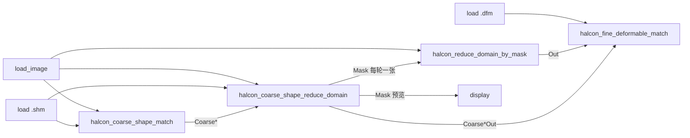

# HALCON 粗定位 + 可变形精匹配 示例

文件：`halcon_coarse_fine_shape_match_example.flow.json`

## 可变形类型怎么选（重要）

| 形变类型 | HALCON 建模 | 本项目模型类型 | 典型场景 |
|----------|-------------|----------------|----------|
| **透视形变**（平面件斜看、梯形） | `CreatePlanarUncalibDeformableModel` | **可变形(透视)** / `deformableKind=planar` | 标签、PCB、平面贴纸视角变化 |
| **局部非刚性形变**（褶皱、软膜） | `CreateLocalDeformableModel` | **可变形(局部)** / `deformableKind=local` | 局部拉伸、鼓包 |

**粗 + 精流程**：刚性 `.shm` 全图找位 → 生成**填充 Mask** → 原图 reduce_domain → `.dfm` 精匹配。

## 流程示意（推荐）

## 算子对照

| 算子 | 作用 |
|------|------|
| `halcon_coarse_shape_match` | 刚性粗定位（FindShapeModel） |
| `halcon_coarse_shape_reduce_domain` | **实心填充**区域 Mask（非模板边缘折线）；有下游时自动循环输出 |
| `halcon_reduce_domain_by_mask` | **原图 + 单张 Mask** → reduce_domain 域内图 |
| `halcon_fine_deformable_match` | 单张域内图 **In + .dfm**；**Coarse*** 接 Mask 的 **Coarse*Out** |
| `halcon_coarse_fine_shape_match` | 粗+精合一（兼容旧流程） |

## 推荐串联

1. `halcon_coarse_shape_match` → 粗候选  
2. `halcon_coarse_shape_reduce_domain`（`loopEmit=true`，默认）→ 每张粗候选循环输出 **Mask**  
3. `halcon_reduce_domain_by_mask`：**Image** + **Mask** → **Out**（每轮一张）  
4. `halcon_fine_deformable_match`：**Out** → In，**.dfm**；**CoarseRow/Column/Angle** ← Mask 的 **CoarseRowOut** 等  

流程引擎对 Mask 下游子图按 `load_image_dir(each)` 方式逐轮执行；精匹配结果在全部轮次结束后汇总为数组。
