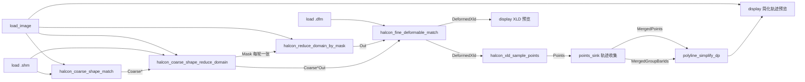

# HALCON 粗定位 + 可变形精匹配 示例

文件：`halcon_coarse_fine_shape_match_example.flow.json`

## 可变形类型怎么选（重要）

| 形变类型 | HALCON 建模 | 本项目模型类型 | 典型场景 |
|----------|-------------|----------------|----------|
| **透视形变**（平面件斜看、梯形） | `CreatePlanarUncalibDeformableModel` | **可变形(透视)** / `deformableKind=planar` | 标签、PCB、平面贴纸视角变化 |
| **局部非刚性形变**（褶皱、软膜） | `CreateLocalDeformableModel` | **可变形(局部)** / `deformableKind=local` | 局部拉伸、鼓包 |

**粗 + 精流程**：刚性 `.shm` 全图找位 → 生成**填充 Mask** → 原图 reduce_domain → `.dfm` 精匹配 → **XLD 采样 → 轨迹收集 → 轮廓点简化**。

## 流程示意（推荐）

## 算子对照

| 算子 | 作用 |
|------|------|
| `halcon_coarse_shape_match` | 刚性粗定位（FindShapeModel） |
| `halcon_coarse_shape_reduce_domain` | **实心填充**区域 Mask（非模板边缘折线）；有下游时自动循环输出 |
| `halcon_reduce_domain_by_mask` | **原图 + 单张 Mask** → reduce_domain 域内图 |
| `halcon_fine_deformable_match` | 单张域内图 **In + .dfm**；**Coarse*** 接 Mask 的 **Coarse*Out**；循环结束后汇总 Row/DeformedXld |
| `halcon_xld_sample_points` | 精匹配 **DeformedXld** → 弧长采样 **Points** |
| `points_sink` | **轨迹收集**：Mask 循环每轮追加点列；**groupIdMode=round** 每轮一条焊道号 |
| `polyline_simplify_dp` | **轮廓点简化**；In ← MergedPoints，GroupBarIds ← MergedGroupBarIds |
| `halcon_coarse_fine_shape_match` | 粗+精合一（兼容旧流程，不含轨迹收集） |

## 推荐串联

1. `halcon_coarse_shape_match` → 粗候选  
2. `halcon_coarse_shape_reduce_domain`（`loopEmit=true`，默认）→ 每张粗候选循环输出 **Mask**  
3. `halcon_reduce_domain_by_mask`：**Image** + **Mask** → **Out**（每轮一张）  
4. `halcon_fine_deformable_match`：**Out** → In，**.dfm**；**CoarseRow/Column/Angle** ← Mask 的 **CoarseRowOut** 等  
5. `halcon_xld_sample_points`：**DeformedXld** → **Points** / **BarIds**（在循环体内，每轮执行）  
6. `points_sink`：**Points** → 循环结束后 **MergedPoints** / **MergedGroupBarIds**  
7. `polyline_simplify_dp`：接 **MergedPoints** + **MergedGroupBarIds**（须在 **轨迹收集** 之后，由引擎延后执行）  

精匹配建议额外连接（示例 flow 已接）：

- **RigidModelId** ← 加载 `.shm`（端部得分修正）  
- **FullImage** ← 原图（透视 `.dfm` ROI 裁剪）  

流程引擎对 Mask 下游子图按 `load_image_dir(each)` 方式逐轮执行；**轨迹收集**在循环内累积，**轮廓点简化**在全部 Mask 轮次结束后自动运行（须用工具栏 **「运行」** 托管引擎）。

## 参数提示

| 算子 | 建议 |
|------|------|
| `halcon_xld_sample_points` | `spacing=4`（像素）；`maxBars=0` 不限制轮廓条数 |
| `points_sink` | `groupIdMode=round`（每个 Mask/粗候选一条轨迹；勿用 preserve，XLD 采样 BarIds 常为全 0 会合并成一条） |
| `polyline_simplify_dp` | `epsilon=2`～`5`；`closed=true`；**必须**接 `MergedGroupBarIds`→`GroupBarIds` |

## 模型路径

示例中默认：

- 形状模板：`flows/shape_model_fixed.shm`（相对 exe 或改绝对路径）
- 可变形模型：`flows/deformable_model.dfm`

加载图像路径请按本机数据修改 `load_image.filePath`。

## 只输出一组轨迹？

1. 看 **轨迹收集** 摘要：应为 `收集 N 轮 · … · 条号 M 种`，`M` 应等于有效 Mask 轮数。若 `M=1` 但 `N>1`，检查 `groupIdMode` 是否为 `round`（不要用 `preserve`）。
2. **轮廓点简化** 必须接 `MergedGroupBarIds`→`GroupBarIds`；未接时会把所有轮次合成一条闭合折线。
3. 组合算子 **Out2** 应接 `polyline_simplify_dp.OutBarIds`（或 `points_sink.BarIds`），不能只接 `Out` 点列。
4. 双击组合算子 →「子流程变量」查看 `points_sink` / `polyline_simplify_dp` 的 `OutBarIds` 种类数。

## 第一条 / 最后一条轨迹不准？

| 原因 | 说明 |
|------|------|
| **Mask 循环顺序** | 轮次 0 = 粗定位**最高分**；最后一轮 = **最低分**候选。`numMatches=0` 会保留全部弱匹配，末条往往天然偏差大。 |
| **端部得分未重排（已修）** | 端部得分修正后须按新分数排序；否则 Mask 顺序与真实质量不一致。 |
| **XLD 采样漏终点（已修）** | 等弧长采样原先可能不含轮廓真实末端，每条轨迹两端会偏。 |
| **参数** | 示例 `endArcFraction` 不宜过大（建议 0.08～0.15）；`closed=true` 仅适合闭合轮廓，开放焊道应设 `false`。 |
| **图像边缘** | 首/末工件靠近图像边界时，ROI 裁剪与 Mask 内缩（`maskErosionPx`）影响更大。 |

建议：限制 `numMatches` 或 `maxCandidates` 去掉低分尾项；开放轮廓用 `polyline_simplify_dp closed=false`。
