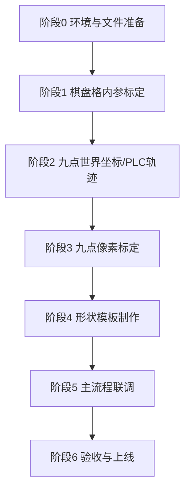

# 产线视觉标定与主流程

**适用软件**：IndustrialVisionTools（x64）  
**工作根目录**：`flows/v4/`（下文 flow 文件名均相对该目录）  
**适用对象**：产线操作员（§1 量产）；视觉/工艺（§换产品标定与部署）  
**流程索引**：[v4/README.md](v4/README.md)  
**技术参考**：[README_workflow_guide.md](README_workflow_guide.md)、[chessboard/README.md](chessboard/README.md)（算子说明）

---

## 1. 量产日常运行

**适用**：同一产品已验收上线后的**每班 / 每次生产**；操作员主路径。

### 1.1 开班

1. 启动 IndustrialVisionTools，加载 **`main.flow.json`**（工艺卡指定的已发布版本，工作目录 `flows/v4/`）。
2. 打开 **PLC** 页：**标定模式 = 关**，**手动模式 = 关**（见 [§PLC 页面](#plc-页面)）；确认 **已连接**。
3. 确认本型号 **models/** 下标定 JSON、模板路径与工艺卡一致（**不在此步修改参数**）。

### 1.2 运行

1. 流程页 **运行**（F5）。
2. 观察匹配得分、Vis、流程日志与 PLC 侧反馈。
3. 班末按现场规范停机；**不得**擅自改标定 JSON、模板、曝光或 flow。

### 1.3 换型提示

切换产品型号时，**停止量产**，改由视觉工程师按下方 **「换产品标定与部署」** 完成配置后再回到 §1。

---

## 2. 量产异常速查

| 现象 | 处理 |
|------|------|
| 流程不跑 / PLC 无响应 | PLC 页是否 **已连接**；**标定模式、手动模式** 是否为 **关**；通知视觉工程师 |
| 匹配失败、得分低 | **停止** → 通知视觉工程师（勿现场改模板） |
| 轨迹/坐标明显不对 | 确认是否误换 flow 或标定文件；通知视觉工程师 |
| send_plc 无数据 | 寄存器、GVAR、splitByBar 与电气核对；通知视觉工程师 |

---

## 换产品标定与部署

**适用**：新产品导入、换型、相机/镜头/光源重大变更、九点物理布局变更、模板重做。  
**执行人**：视觉调试工程师（阶段 1–6）、工艺/PLC（阶段 2 中心与步距）。完成后验收上线，产线恢复 **§1 量产日常运行**。

### 换型流程总览



| 阶段 | 目标 | 主要 flow / 界面 |
|------|------|------------------|
| 0 | 目录、相机、PLC 就绪 | — |
| 1 | 内参 + 畸变 + 选定 `viewIndex` | `chessboard_intrinsics_from_dir.flow.json` |
| 2 | 定中心 + 定间距偏移，生成九点 world | `calibSendContour.flow.json` → `models/world_pos.txt` |
| 3 | 像素 ↔ 世界仿射，保存九点 JSON | `caliNinePoint.flow.json` |
| 4 | 粗/精/外框等 `.shm` / `.dfm` | 菜单 **高级功能 → 形状模板** |
| 5 | 检测、匹配、转世界、下发 PLC | `main.flow.json` |
| 6 | 误差、稳定性、版本归档 | 标定质检 + 试跑 N 次 |

### v4 流程包

| 用途 | 文件（位于 `flows/v4/`） |
|------|--------------------------|
| 棋盘内参 | `chessboard_intrinsics_from_dir.flow.json` |
| 九点世界坐标 | `calibSendContour.flow.json`（**weld_trajectory_world**）→ `models/world_pos.txt` |
| 九点像素标定 | `caliNinePoint.flow.json` |
| 主流程 | `main.flow.json` |
| 粗 / 精匹配调试 | `halcon_coarse_shape_match.flow.json`、`halcon_fine_shape_match.flow.json` |

> 打开任意 flow 时，**当前目录应为 `flows/v4/`**；组合算子 `innerFlowPath` 指向**同目录**子 flow（如 `main` → `halcon_coarse_shape_match.flow.json`）。

---

## 阶段 0：环境与文件准备

### 0.1 现场硬件

- [ ] 相机固定、焦距/光圈锁定，标定与量产**同一光学条件**。
- [ ] 光源亮度、曝光、增益记录到《成像参数表》（后续变更须重标或验证）。
- [ ] PLC 通讯地址、GVAR 布局与 `send_plc` 参数一致。

### 0.2 物理件与数据目录

- [ ] 棋盘格：规格与 flow 中 `cols` / `rows` / `squareSizeMm` **完全一致**。
- [ ] 九点标定板：圆点检测网格为 **3×3**（与九点世界坐标一一对应；整板若有更多圆点可忽略）。
- [ ] 确认 **`flows/v4/`** 下目录齐全（缺则新建）：
  - `models/` — 九点 JSON、标定板图、`world_pos.txt`、模板 `.shm` / `.dfm`
  - `chessboard/` — 阶段 1 输出 `calibration_result.json`
  - `captured_chessboard/` — 棋盘采图（阶段 1 默认 `imageDirectory`）
  - `roi/` — 粗/精/外框 ROI（`.xvroi.json`，与主流程配套）

### 0.3 角色分工

| 角色 | 职责 |
|------|------|
| 视觉工程师 | 阶段 1、3、4、5、6 |
| 工艺/PLC | 阶段 2 中心点/步距测定、与工艺尺寸核对 |
| 产线操作员 | §1 量产日常运行 |

---

## PLC 页面 {#plc-页面}

**入口**：主界面顶部 **「PLC」** 标签（`PlcPage`）。**量产时**仅需连接且 **标定模式 / 手动模式 = 关**；下列手动、标定模式主要用于 **换产品** 阶段 2 等。

### 连接

1. 填写 **IP**、**端口**（与现场 / `plc_config.json` 一致），单击 **连接**。
2. 右上角状态为**已连接**后再进行下列操作；**实时位置**区可勾选 **自动刷新** 或单击 **读取** 查看 X / Y / Z。

### 模式开关（必守顺序）

| 按钮 | 作用 | 何时使用 |
|------|------|----------|
| **手动模式** | 置位 PLC 手动（旁显示 **Manual**） | **任意手动操作之前必须先开** |
| **关闭手动模式** | 退出手动 | 标定/调试结束、恢复 **§1 量产** 前 |
| **标定模式** | 单击 **开**，再单击 **关**（旁显示 **开/关**） | **整段标定流程开始前先开**；全部标定做完再关 |

**规则（务必遵守）：**

1. **未点「手动模式」前**，不要进行 X/Y/Z **点动**（正转/反转/回零）、轴 **使能**、**手动→拍照位** / **手动→安全位** 等手动运动。
2. 执行 **阶段 2**（定 center / step）、配合 **calibSendContour**、或现场要求 PLC 处于标定状态时：**先开「标定模式」**（显示 **开**），再用手动移动机台或跑标定相关 flow。
3. 标定全部完成后：**先关「标定模式」**，再 **关闭手动模式**，避免设备留在标定/手动状态进入量产。

### 阶段 2 推荐操作顺序（测 center / step）

1. **连接** → **手动模式** → **标定模式（开）**  
2. 需要时：**手动→拍照位**，或将轴 **使能** 后 **点动** 到九点区域中心，从 **实时位置** 读取 **centerX/Y/Z**（记入 §9 记录表）。  
3. 点动到同行/同列相邻位置，读坐标差得到 **stepXmm**、**stepYmm**。  
4. 数值填入 **`calibSendContour.flow.json`** 的 **weld_trajectory_world**（见阶段 2 §2.3）。标定结束恢复 **§1 量产** 所要求的 PLC 模式。  
5. 结束：**标定模式（关）** → **关闭手动模式**。

### 与流程页的关系

- **PLC 页**：人机连接、模式、点动、读位置。  
- **流程页** `plc_connect` / `send_plc`：自动流程通讯；跑 flow 前仍建议 PLC 页已连接，且标定阶段 **标定模式** 已按工艺要求打开。

---

## 阶段 1：棋盘格内参标定

**目标**：得到 `CalibrationJson`（内参、畸变、多视图外参），并确定透视用 **`viewIndex`**。

### 1.1 采图

1. 在流程页加载 **`chessboard_intrinsics_from_dir.flow.json`**（工作目录 `flows/v4/`）。
2. 使用 **camera_calib_capture** 或目录 **`captured_chessboard/`**：
   - 棋盘**完整入画**、共面、姿态多样（俯仰/偏航变化）；
   - **至少 1 张较正、完整**（专用于后续 `viewIndex`）；
   - 建议 ≥ 15 张（以 flow 内说明/质检为准）。
3. 设置 `imageDirectory`、`cols`、`rows`、`squareSizeMm` 与物理棋盘一致。

### 1.2 运行标定

1. **运行**（F5）整流程或标定链至 `save_calibration_result`。
2. 查看 **标定质检**对话框/报告：
   - [ ] 重投影误差在项目阈值内；
   - [ ] 失败张数可接受或已剔除重拍。
3. 保存输出：**`chessboard/calibration_result.json`**（及 `chessboard/calibration_full.json`，以 flow 为准）。

### 1.3 确定 viewIndex

1. 打开 JSON 中 `extrinsicsPerView`，顺序与**标定成功**图像列表一致（从 **0** 起）。
2. 找到「较正」那张图对应的序号 → 记为 **`viewIndex`**（写入工艺卡）。
3. 后续所有 **透视展开**、**calibration_correct_image** 默认使用该 `viewIndex`。

### 1.4 透视/去畸变参数（产线默认）

| 参数 | 推荐 |
|------|------|
| `perspectiveOutputFrame` | `plane` |
| `perspectiveOutputScale` | `board_pixels` |
| 多视角固定画布 | 改用 `metric`（见 chessboard README） |

### 1.5 阶段 1 验收

- [ ] JSON 可被 `intrinsics_undistort_image` / `chessboard_perspective_warp_image` 加载。
- [ ] 去畸变、透视目视无严重拉伸/黑边异常。
- [ ] `viewIndex` 已书面记录。

---

## 阶段 2：九点世界坐标（中心点 + 偏移 → 填入流程）

**目标**：在机台上**确定 3×3 九点的几何中心**与**行列间距（偏移）**，写入 **`calibSendContour.flow.json`** 的 **weld_trajectory_world**，由流程**生成** 9 个世界坐标并供阶段 3 使用。  
**不是**逐点示教 9 次；**是**「一个中心 + 两个步距」描述整网。

### 2.1 确定中心点

1. 按 **§PLC 页面**：**连接 → 手动模式 → 标定模式（开）**（标定结束再关）。
2. 标定板/九点治具就位于阶段 3 拍照位，坐标系与量产一致（同一 TCP/工件坐标系）。
3. 移动机台到 **3×3 九点的几何中心**（与标定板**中心圆点**或工艺定义的九点中心重合；可用 PLC 页 **点动** 或 **手动→拍照位** 后再微调）。
4. 在 PLC 页 **实时位置** 读取并记录（单位 **mm**）：
   - **centerX**、**centerY**
   - **centerZ**（若 Z 参与工艺或 `send_plc` 需要）
5. 记入 **标定记录表**「九点中心」。

> 软件中 **weld_trajectory_world** 的 center 即该几何中心；生成的 9 点以 center 为网格中心对称展开（3×3 时 center 对应**中间那一点**的世界坐标）。

### 2.2 确定偏移（步距）

1. **stepXmm**：相邻两列中心在 **X 方向**的间距 (mm)。  
   - 测定：机台移到同行相邻两列圆点（或工艺治具标定孔），读坐标差 `|ΔX|`；或按工艺图纸标称值。
2. **stepYmm**：相邻两行中心在 **Y 方向**的间距 (mm)。  
   - 测定：同行方法，读 `|ΔY|`；或图纸标称值。
3. 若 `stepXmm` / `stepYmm` 留空，部分配置会回退到统一 **stepMm**；九点标定建议**显式填写** X、Y 步距。
4. 将 stepX、stepY 记入记录表，并与工艺**核对**。

### 2.3 填入流程并生成九点坐标

1. 加载 **`calibSendContour.flow.json`**（工作目录 `flows/v4/`）。
2. 编辑 **weld_trajectory_world** 算子：

| 参数 | 填写说明 |
|------|----------|
| `pattern` | **九宮格 (3×3)**（与 3×3 九点一致） |
| `centerX` / `centerY` / `centerZ` | §2.1 测定的中心 |
| `stepXmm` / `stepYmm` | §2.2 测定的列距、行距 |
| `gridRows` / `gridCols` | **3** / **3** |
| `angleDeg` / `rotateDeg` | 按产线坐标系；无旋转则 0 |

3. **生成 world 文件**（供阶段 3，不必先跑完整焊机循环）：  
   运行 **`weld_trajectory_world` → `points_to_text` → `save_text`** 链路，输出 **`models/world_pos.txt`**（每行 `X,Y`，共 9 行，顺序为**行优先：左→右、上→下**）。  
   - 若整 flow 含 PLC 下发，调试时可**仅执行上述生成支路**，或按现场规范临时禁用 `send_plc` 等节点。
4. 打开 **`caliNinePoint.flow.json`**，确认 **calibrate** 算子：
   - `worldPointsFile` = `models\world_pos.txt`（推荐）；或
   - `worldPoints` 与文件内容一致的 9 对分号串。
5. 保存两个 flow。

### 2.4 顺序约定

- 生成点顺序：**3×3 行优先**（第 1 行左→右，再第 2、3 行），与阶段 3 像素 3×3、工艺九点表一致。
- 若机台 X/Y 正方向与视觉「左/右、上/下」相反，通过调整 step 符号或 `rotateDeg` 修正，并在工艺卡说明；**勿只改文件行序而不改参数**。

### 2.5 可选：PLC 轨迹下发

需要现场走九点焊机轨迹时，在同一 **`calibSendContour.flow.json`** 中配置 **plc_connect**、**send_plc** 等，在 world 文件确认无误后再使能下发。

### 2.6 阶段 2 验收

- [ ] center、stepX、stepY 与记录表、工艺尺寸一致。
- [ ] `models/world_pos.txt` 为 **9 行**，中心点对应文件**第 5 个点**（3×3 正中间）。
- [ ] **calibrate** 已指向该 world 文件；换中心/步距后须重新生成并锁定版本。

---

## 阶段 3：九点像素标定

**目标**：在**已矫正**标定板图像上检测圆点，建立像素 → 世界仿射，保存 `calibration_nine_point.json`。

### 3.1 推荐 flow

加载 **`caliNinePoint.flow.json`**（链：取图 → 翻转 → 去畸变 → 透视 → **detect_calibration_dots** → calibrate → 保存）。

圆点检测详细步骤见附录 A：[v4/九点标定_圆点检测.md](v4/九点标定_圆点检测.md)。

### 3.2 关键配置摘要

| 节点 | 要点 |
|------|------|
| load_image / camera_snap | 标定板完整、与量产同曝光 |
| intrinsics_undistort_image | `calibrationJsonFile` = `chessboard/calibration_result.json` |
| chessboard_perspective_warp_image | `viewIndex` = 阶段 1 记录值；棋盘 cols/rows 一致 |
| detect_calibration_dots | 默认 `gridRows=3`, `gridCols=3`；Vis 见绿框 + 蓝圈对齐 9 个圆点 |
| calibrate | `worldPointsFile` = 阶段 2 生成的 `models/world_pos.txt`；`confirmCorrespondence=true` |
| save_calibration_result | 输出 `models/calibration_nine_point.json` |

### 3.3 配对与误差

1. 运行 **calibrate** 时，在对话框中核对 **9 组**像素↔世界配对。
2. 填写 `calibrationJsonFile` 连接棋盘 JSON 时，查看 **[系统整体误差]**（可选）。
3. 需要微调：运行 **adjust_affine_calibration**（`interactiveAdjust=true`）。

### 3.4 阶段 3 验收

- [ ] Vis 无金属边框误检（若满屏边框蓝圈 → 见下方 **标定异常速查**）。
- [ ] 检出点数 ≥ 9，配对正确。
- [ ] 重投影/项目误差合格。
- [ ] JSON 备份并登记版本号。

---

## 阶段 4：形状模板制作

**入口**：主界面 **高级功能 ▾ → 形状模板**（HalconShapeModelPage）。

### 4.1 制作顺序（推荐）

```text
外框模板（大角度） → 粗匹配模板（位置） → 精匹配/可变形模板（轮廓） → 专用模板（标定板圆/焊点，若主流程仍用 HALCON 找点）
```

| 类型 | 文件 | 用途 |
|------|------|------|
| 外框 | `.shm` | 方向粗定位，角度范围宜大 |
| 粗匹配 | `.shm` | 位置粗定位，供精匹配 ROI |
| 精匹配 | `.dfm` / `.shm` | 最终轮廓、轨迹采样 |
| 焊点/圆 | `.shm` | 阵列焊点定位（与九点标定配合） |

### 4.2 操作要点

1. 使用与**量产一致**的矫正图（阶段 1+3 同一矫正链）制作模板。
2. 轮廓贴合、阈值稳定；粗匹配失败则精匹配必偏 — 先调粗后调精。
3. 模板保存到 **`flows/v4/models/`** 或 v4 根目录，在 `halcon_coarse_shape_match.flow.json` / `halcon_fine_shape_match.flow.json` 中用**相对 v4 的路径**加载。
4. 记录：模板名、创建日期、对应产品型号、匹配角度/缩放范围。

### 4.3 阶段 4 验收

- [ ] 同目录 **`halcon_coarse_shape_match.flow.json`**、**`halcon_fine_shape_match.flow.json`** 单图匹配稳定（再跑 **`main.flow.json`**）。
- [ ] 角度/位置覆盖量产波动范围。

> **说明**：v4 九点 flow **不依赖**标定板 `cali_board.shm`；主流程工件模板仍按本节制作。

---

## 阶段 5：主流程联调

**目标**：采集 → 矫正 → 粗/精匹配 → 轮廓/轨迹 → **img_to_world** → **send_plc** 全链打通。

### 5.1 加载标定

1. 加载 **`main.flow.json`**。
2. **load_calibration_result**：`models/calibration_nine_point.json`（阶段 3 输出）。
3. 图像链：**camera_snap / plc_wait_camera_capture** 等 → 去畸变/透视（`chessboard/calibration_result.json` + **同一 viewIndex**）。

### 5.2 模板与子流程

1. 在 **`halcon_coarse_shape_match.flow.json`** / **`halcon_fine_shape_match.flow.json`** 中配置 `halcon_load_shape_model` / `halcon_load_deformable_model` 路径。
2. 检查 **`main.flow.json`** 组合算子 `innerFlowPath` 为同目录 `halcon_coarse_shape_match.flow.json`、`halcon_fine_shape_match.flow.json`。
3. 粗匹配 **Row/Col/Angle** 接入精匹配 **CoarseRow/CoarseColumn/CoarseAngle**；ROI 可使用 `roi/*.xvroi.json`；算法说明见 [halcon/README_coarse_fine_shape_match.md](halcon/README_coarse_fine_shape_match.md)。

### 5.3 PLC

1. **plc_connect** 参数与现场一致。
2. **send_plc**：`splitByBar`、寄存器、`gvarStartRegister` 等与电气文档一致。
3. 空跑 / 模拟：先 **img_to_world** 目视坐标，再使能下发。

---

## 阶段 6：验收与上线

### 6.1 交付清单

- [ ] `calibration_result.json`（棋盘）+ 记录的 `viewIndex`
- [ ] `calibration_nine_point.json`（九点）+ `world_pos` 来源说明
- [ ] 模板文件列表（`.shm` / `.dfm`）
- [ ] 主 flow 最终版路径、成像参数表、PLC 地址表
- [ ] §9《标定记录表》

### 6.2 变更管理

| 变更项 | 是否需重标 |
|--------|------------|
| 相机/镜头/光圈/焦距 | 是（阶段 1 起） |
| 光源显著变化 | 建议重验证；严重则重标 |
| 棋盘/标定板更换 | 是 |
| 九点物理位置变更 | 阶段 2、3 |
| 仅模板 ROI 微调 | 阶段 4、5 验证 |

---

## 标定异常速查

### 九点圆点 Vis 满屏误检（边框/背景）

| 原因 | 处理 |
|------|------|
| 圆点检测仍为旧算法表现 | 确认使用 v4 **`caliNinePoint.flow.json`** 并重启软件后重跑 |
| grid 行列不对 | 改 `gridRows` / `gridCols` |
| 反光漏检 | 降 `dotContrastMin` 或调 `morphKernelSize` |

### 标定与坐标

| 现象 | 处理 |
|------|------|
| 九点重投影误差大 | 先核对 center/step 与 `world_pos.txt`、像素顺序与 3×3、`confirmCorrespondence` 配对是否正确；仍偏大时运行 **`adjust_affine_calibration`**（`caliNinePoint` 中 `interactiveAdjust=true` 对话框微调平移/缩放，或设 `offsetWorldX/Y`、`scaleX/Y` 一次性修正）→ 再跑 **`save_calibration_result`** 覆盖九点 JSON |
| 透视图尺寸/角度异常 | 检查 `viewIndex` 是否对应「较正」标定图 |
| img_to_world 偏差 | 确认加载的是最新 `calibration_nine_point.json` |

### 匹配联调（阶段 5）

| 现象 | 处理 |
|------|------|
| 精匹配偏 | 粗匹配是否成功；模板边缘；Mask/CoarseAngle 是否接入 |
| world 第 5 点不是中心 | 检查 center 是否对准几何中心；step 符号与 rotateDeg |

---

## 标定记录表（模板）

| 项目 | 内容 |
|------|------|
| 日期 / 操作人 / 产品型号 | |
| 相机 SN / 曝光 / 增益 | |
| 棋盘 cols×rows / squareSizeMm | |
| viewIndex | |
| 棋盘 JSON 路径 / 重投影误差 | |
| 九点 centerX/Y/Z、stepXmm、stepYmm | |
| 九点 JSON 路径 / 误差摘要 | |
| 主 flow 版本 / 模板版本 | |
| 验收签字（视觉 / 工艺） | |

---

## 附录

### 附录 A — 九点圆点检测（v4 专章）

[v4/九点标定_圆点检测.md](v4/九点标定_圆点检测.md)

### 附录 B — 文档索引

| 文档 | 内容 |
|------|------|
| [README_workflow_guide.md](README_workflow_guide.md) | 部署顺序与 flow 说明 |
| [chessboard/README.md](chessboard/README.md) | 棋盘算子与透视参数 |
| [halcon/README_coarse_fine_shape_match.md](halcon/README_coarse_fine_shape_match.md) | 粗精匹配 |
| [halcon/README_shape_model_match.md](halcon/README_shape_model_match.md) | 形状模板匹配 |
| `XVCalibrate/ARCHITECTURE.md` | 软件架构 |

---

**修订记录**

| 版本 | 日期 | 说明 |
|------|------|------|
| 1.0 | — | 初版：阶段 0–6 + 日常运行 + v4 九点圆点检测 |
| 1.1 | — | 全流程统一为 **flows/v4** 流程包 |
| 1.2 | — | 阶段 2：中心点 + 步距偏移 → **weld_trajectory_world** |
| 1.3 | — | 新增 **PLC 页面**（手动模式 / 标定模式） |
| 1.4 | — | **§1 量产** 置前；标定阶段归入 **换产品标定与部署** |
